# PropertyPulse

**AI-powered property renovation analyzer using Gemini 3**

Paste a Rightmove URL and get instant:
- AI room-by-room condition analysis
- Detailed UK renovation cost estimates (with London pricing)
- AI-generated "after" visualizations with before/after slider
- Real-time "reasoning" showing AI thought process

Built for the **Google DeepMind Gemini 3 Hackathon 2026**.

---

## Gemini Integration (Hackathon Submission)

PropertyPulse leverages **three Gemini 3 family capabilities** to transform how property investors evaluate renovation potential:

**1. Gemini 3 Flash Preview (Vision Analysis)**
Each property photo is analyzed using Gemini 3 Flash Preview's multimodal capabilities. The model identifies room types, assesses condition on a 1-10 scale, spots specific issues (dated fixtures, wear patterns, structural concerns), and recommends prioritized renovation items. This replaces hours of manual surveyor assessment with instant AI analysis.

**2. Nano Banana Pro (Image-to-Image Transformation)**
Unlike text-to-image generation, Nano Banana Pro takes the *original* room photo and transforms it into a renovated version while preserving the exact camera angle, room layout, and perspective. Style-aware prompts ensure Victorian properties get period-sympathetic renovations, not modern white render.

**3. Agentic Progress with Reasoning**
The UI streams real-time "reasoning" steps showing the AI's thought process - identifying room types, detecting issues, calculating costs, and explaining decisions. This makes the ~60 second analysis engaging and demonstrates agentic behavior.

---

## Quick Start

```bash
# Create virtual environment
python -m venv venv
source venv/bin/activate  # Windows: venv\Scripts\activate

# Install dependencies
pip install -r requirements.txt

# Install Playwright browser
playwright install chromium

# Set your Gemini API key
echo "GEMINI_API_KEY=your_key_here" > .env

# Run the app
python main.py
```

Open **http://localhost:8000** in your browser.

---

## Architecture

```mermaid
flowchart TB
    subgraph USER["👤 User"]
        URL[/"Rightmove URL"/]
        REFINE[/"✨ Refine Prompt"/]
    end

    subgraph SERVER["FastAPI Server"]
        direction TB
        API["REST API + SSE Stream"]

        subgraph PIPELINE["Analysis Pipeline"]
            direction TB
            SCRAPER["🔍 Scraper<br/><i>Playwright</i>"]
            ANALYZER["🧠 Room Analyzer<br/><i>Gemini 3 Flash Preview</i>"]
            COST["💰 Cost Engine<br/><i>UK 2024 Prices</i>"]
            IMAGEN["🎨 Visualizer<br/><i>Nano Banana Pro</i>"]
        end
    end

    subgraph GEMINI["Google Gemini 3 API"]
        FLASH["Gemini 3 Flash Preview<br/><i>Vision Analysis</i>"]
        NANO["Nano Banana Pro<br/><i>Image-to-Image</i>"]
    end

    subgraph OUTPUT["📊 Results"]
        ROOMS["Room Analysis<br/>+ Condition Scores"]
        COSTS["Cost Breakdown<br/>+ Essential Works"]
        VISUALS["Before/After<br/>Visualizations"]
    end

    URL --> API
    API --> SCRAPER
    SCRAPER -->|"Images + Details"| ANALYZER
    ANALYZER <-->|"Multimodal Analysis"| FLASH
    ANALYZER -->|"Room Data"| COST
    COST -->|"Prioritized Rooms"| IMAGEN
    IMAGEN <-->|"Style-Aware Transform"| NANO

    ANALYZER --> ROOMS
    COST --> COSTS
    IMAGEN --> VISUALS

    VISUALS -.->|"User Feedback"| REFINE
    REFINE -.->|"Custom Prompt"| IMAGEN

    style FLASH fill:#4285f4,color:#fff
    style NANO fill:#4285f4,color:#fff
    style ANALYZER fill:#e8f0fe,stroke:#4285f4
    style IMAGEN fill:#e8f0fe,stroke:#4285f4
    style REFINE fill:#fef3c7,stroke:#f59e0b
```



### API Endpoints

| Endpoint | Description |
|----------|-------------|
| `GET /` | Main UI (Jinja2 + Tailwind + Alpine.js) |
| `POST /analyze` | Start analysis job, returns job ID |
| `GET /analyze/{id}/stream` | SSE endpoint for real-time reasoning |
| `GET /analyze/{id}` | Get results (polling fallback) |
| `POST /analyze/{id}/refine/{room}` | Regenerate visualization with custom prompt |

### Pipeline Flow

1. **Scraper** - Playwright extracts images, floorplan, property details from Rightmove
2. **Analyzer** - Gemini 3 Flash Preview analyzes each photo (room type, condition 1-10, issues)
3. **Cost Engine** - Applies UK 2024 pricing with London multiplier, calculates per-room costs
4. **Visualizer** - Nano Banana Pro transforms original photos into renovated versions
5. **Refine Loop** - User can adjust prompts and regenerate any visualization with custom instructions

---

## Tech Stack

| Component | Technology |
|-----------|------------|
| Backend | FastAPI + Python 3.11+ |
| Frontend | Jinja2 + Tailwind CSS (CDN) + Alpine.js (CDN) |
| AI Vision | Gemini 3 Flash Preview |
| AI Image Gen | Nano Banana Pro |
| Scraping | Playwright |
| Real-time | Server-Sent Events (SSE) |

**No npm, no Node.js, no build step.** Single `python main.py` serves everything.

---

## Project Structure

```
propertypulse/
├── main.py              # FastAPI app entry point with SSE streaming
├── requirements.txt     # Python dependencies
├── .env                 # GEMINI_API_KEY (not in repo)
│
├── src/                 # Core application modules
│   ├── analyzer.py      # Gemini 3 Flash vision analysis
│   ├── cost_engine.py   # UK renovation costs with regional pricing
│   ├── image_gen.py     # Nano Banana Pro style-aware visualization
│   └── scraper.py       # Rightmove scraper (Playwright)
│
├── templates/           # Jinja2 HTML templates
│   └── index.html       # Single-page UI
│
├── static/              # Static assets (CSS, JS, images)
│
├── data/                # Runtime data (DB, debug files)
│   └── property_pulse.db
│
├── tests/               # Test files
│   ├── test_scraper.py
│   └── test_image_gen.py
│
└── scripts/             # Utility & debug scripts
    ├── check_models.py
    └── debug_*.py
```

---

## Features

- **Multi-pattern scraping**: Handles 3 different Rightmove image URL formats
- **Style-aware renovations**: Victorian properties get period-sympathetic updates, not modern white render
- **London pricing**: 1.35x regional multiplier automatically applied for London properties
- **Essential works detection**: Highlights must-do items for derelict properties (rewire, heating, etc.)
- **Real-time reasoning**: Shows AI thought process as it analyzes
- **Before/after slider**: Interactive comparison of original vs renovated visualization

---

## Environment Variables

```env
GEMINI_API_KEY=your_gemini_api_key_here
```

---

## Deployment

Single server deployment - no separate frontend needed:

```bash
# Production with Gunicorn
pip install gunicorn
gunicorn main:app -w 4 -k uvicorn.workers.UvicornWorker -b 0.0.0.0:8000
```

---

## License

MIT - Built for Google DeepMind Gemini 3 Hackathon 2026
